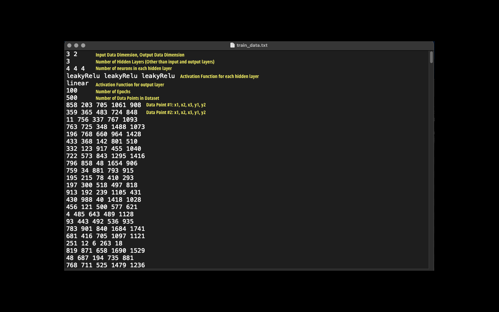

# Neural Network C++
- This is a C++ implementation of a *fully connected feed forward neural network*
- Uses Stochastic Gradient Descent with ADAM Optimizer

## Input Data Format


## Running the Code
```bash
g++ -o net neuralNetwork.cpp
./net
```